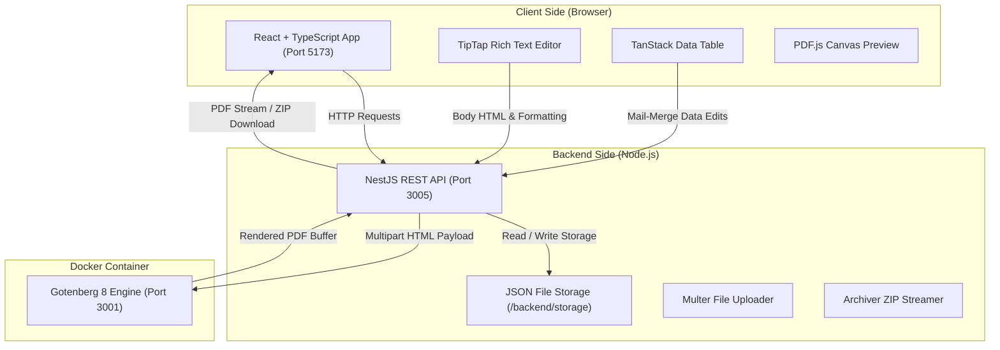

# 📄 ShineCraft Letterhead Generator & Mail-Merge Tool

> **Comprehensive End-to-End Project Documentation**  
> *A full-stack web application for creating custom letterhead templates, managing dynamic dataset rows, rendering pixel-perfect PDFs, and bulk-exporting merged documents.*

---

## 🚀 Quick Start Guide (How to Run Frontend, Backend & Docker)

Follow these steps at the top of the document to get the complete stack up and running locally.

### 📋 Prerequisites
- **Node.js**: `v18.x` or higher
- **npm**: `v9.x` or higher
- **Docker Desktop**: Running locally (for Gotenberg PDF rendering engine)

---

### 1️⃣ Step 1: Start the Docker Container (Gotenberg PDF Engine)

Gotenberg is used by the backend to convert HTML/CSS templates into paginated, print-ready PDF documents.

Open your terminal in the project root directory (`template-merge-tool`):

```bash
docker compose up -d
```

Verify Gotenberg is running:
```bash
docker ps
```
> Gotenberg should be listening on port `3001` (mapped to container port `3000`). Test in browser: [http://localhost:3001/health](http://localhost:3001/health)

---

### 2️⃣ Step 2: Start the Backend Server (NestJS API)

Open a new terminal window:

```bash
# Navigate to backend directory
cd backend

# Install dependencies (first time only)
npm install

# Start in development mode (auto-reload)
npm run start:dev
```

- **Backend API URL**: [http://localhost:3005](http://localhost:3005)
- **Environment File**: `backend/.env`
  ```env
  PORT=3005
  FRONTEND_URL=http://localhost:5173
  GOTENBERG_URL=http://localhost:3001
  ```

---

### 3️⃣ Step 3: Start the Frontend Application (React + Vite)

Open another terminal window:

```bash
# Navigate to frontend directory
cd frontend

# Install dependencies (first time only)
npm install

# Start Vite dev server
npm run dev
```

- **Frontend Application URL**: [http://localhost:5173](http://localhost:5173)

---

### 📊 Service Port Summary Table

| Service | Technology | Local URL | Port |
| :--- | :--- | :--- | :--- |
| **Frontend Web App** | React + Vite + TypeScript | [http://localhost:5173](http://localhost:5173) | `5173` |
| **Backend REST API** | NestJS + Express | [http://localhost:3005](http://localhost:3005) | `3005` |
| **PDF Renderer** | Gotenberg 8 (Docker) | [http://localhost:3001](http://localhost:3001) | `3001` |

---

## 🛠️ System Architecture & Technology Stack



### Stack Breakdown:
- **Frontend Core**: React 18, TypeScript, Vite, React Router DOM v6
- **Rich Text & Formatting**: TipTap Headless Editor (StarterKit, Table, FontFamily, FontSize, Color, PageBreak, TextAlign, Underline, Sub/Superscript)
- **Data & Tables**: TanStack React Table v8, Custom CSV parser
- **Preview & Rendering**: PDF.js (Mozilla), Canvas rendering
- **Backend Core**: NestJS, Express, RxJS, Multer (file handling), Archiver (ZIP packaging)
- **PDF Engine**: Gotenberg 8 running inside Docker (headless Chromium & LibreOffice rendering)
- **Design System**: Vanilla CSS tokens, Glassmorphism, Micro-animations, Spring transitions

---

## 📜 Project History & Development Timeline (Beginning to End)

### 🔹 Phase 1: Initial Architecture & Foundations
- Established monorepo layout with decoupled `frontend/` and `backend/` services.
- Set up Docker Compose for Gotenberg PDF compilation.
- Designed JSON-file persistent storage layer in NestJS for template records and mail-merge rows.

### 🔹 Phase 2: Template Creator & TipTap Integration
- Built `TemplateCreatorEditor` wrapping TipTap with an inline formatting toolbar.
- Added support for font families, sizes, colors, highlight background colors, table insertion & cell manipulation, and manual page breaks.
- Created `PlaceholdersPanel` for click-to-insert `{placeholder}` tags directly at the active cursor position.

### 🔹 Phase 3: DOCX Import & Dynamic Placeholder Detection
- Implemented DOCX parsing endpoint using `mammoth.js` to convert uploaded Word files into HTML.
- Built automatic regex extraction for `{placeholder}` merge fields in document body.
- Added read-only formatting enforcement for imported DOCX files to protect layout structures.

### 🔹 Phase 4: Page Margins & Header/Footer Layout Engine
- Added Word-compliant page margin configurations (Normal 1.0 in, Narrow 0.5 in, Wide 1.5 in, or custom inputs in inches and centimeters).
- Added Header and Footer toggle controls with support for raw HTML text or uploaded image logos (with automatic height constraint scaling).
- Integrated margin and header/footer parameters directly into Gotenberg API multipart payloads.

### 🔹 Phase 5: Mail-Merge Data Table & CSV Importer
- Built `DataTable` component using TanStack Table for editing template rows.
- Created CSV dataset uploader with automatic header-to-placeholder matching.
- Implemented bulk ZIP export (`Archiver`) to package all generated PDFs into a single download.

### 🔹 Phase 6: UI Overhaul, Layout Width Expansion & Info View
- Transformed static template info sidebar into an interactive **`ℹ️ Template Info`** icon button opening a glassmorphic popover modal with 1-click ID copy.
- Expanded edit page layout width from `1200px` to **`1550px`** for maximum editor canvas workspace.

### 🔹 Phase 7: Interactive Micro-Animations & Keyboard Navigation
- Added tactile button click press feedback (`transform: scale(0.96)`) across all interactive elements.
- Implemented **`Enter` / `Tab` key navigation** in `DataTable` cells: pressing `Enter` saves the cell and automatically jumps to edit the next area/cell.
- Added `Enter` key focus chaining in Page Margin inputs and Template Creation forms.
- Upgraded Admin top-bar profile button into a working System Operational Status popover.

---

## 🎨 Detailed Feature Walkthrough

### 1. Template Creator Page (`/create/:templateId`)
- **Name Editing**: Rename template on the fly with live autosave status indicator.
- **TipTap Canvas**: Type text, insert tables, format fonts, apply highlights, and insert `{placeholders}`.
- **Page Margins Setup**: Configure Top, Bottom, Left, and Right margins with unit toggle (`Inches (in)` vs `Centimeters (cm)`).
- **Header & Footer Configuration**: Enable or disable header/footer overlays, switch between HTML address text or uploaded image logo.
- **Live Preview Toggle**: Switch seamlessly between editor canvas and compiled PDF document view.

### 2. Mail-Merge & Editor Page (`/editor/:templateId`)
- **Data Table**: View and edit row data. Pressing `Enter` commits the value and advances to the next cell.
- **Row Selector**: Click any row to update the live single-row PDF preview instantly.
- **Preview Modes**: Toggle between `Selected Row` single preview or `All Rows` multi-document preview.
- **Exporting**: Download individual PDF, print directly via native dialog, or download all records as a `.zip` file.

### 3. Template Gallery (`/templates`)
- View templates in **Card Grid** or **Data Table** layouts.
- Filter templates by name or ID with clear search button `✕`.
- Quick action buttons to Edit, Download PDF, or Delete template.

### 4. Datasets Page (`/datasets`)
- Overview of all dataset summaries, total record counts, and last updated timestamps.
- Bulk upload CSV files to merge new records into templates.
- Clear row data or jump directly to data row editor.

---

## ⌨️ Keyboard Shortcuts & Shortcuts Guide

| Area | Keyboard Action | Result |
| :--- | :--- | :--- |
| **Mail-Merge Table** | `Enter` or `Tab` | Saves current cell & moves focus to **Next Cell/Area** |
| **Mail-Merge Table** | `Shift + Enter` or `Shift + Tab` | Saves current cell & moves focus to **Previous Cell/Area** |
| **Mail-Merge Table** | `Escape` | Cancels current cell editing |
| **Margin Setup** | `Enter` | Moves focus to next margin input (`Top` $\rightarrow$ `Bottom` $\rightarrow$ `Left` $\rightarrow$ `Right` $\rightarrow$ `Save`) |
| **Create Dialog** | `Enter` | Submits template creation form |
| **Info Modal** | `Escape` | Closes Template Info modal |

---

## 📡 Backend API Reference

### 📄 Templates API (`/api/templates`)
- `GET /api/templates` — List all templates
- `GET /api/templates/:id` — Get single template record by ID
- `POST /api/templates/starters` — Create new template from starter (`blank` or `shinecraft`)
- `POST /api/templates/import` — Import DOCX file as template
- `PUT /api/templates/:id/content` — Update template body HTML, header/footer HTML, and margins
- `PATCH /api/templates/:id/name` — Rename template
- `DELETE /api/templates/:id` — Delete template and associated rows

### 🗂️ Datasets API (`/api/datasets`)
- `GET /api/datasets` — List dataset summaries for all templates
- `GET /api/datasets/:templateId/rows` — Get data rows for a specific template
- `POST /api/datasets/:templateId/rows` — Create an empty or pre-filled data row
- `PUT /api/datasets/:templateId/rows/:rowId` — Update cell value in row
- `DELETE /api/datasets/:templateId/rows/:rowId` — Delete single data row
- `POST /api/datasets/:templateId/csv` — Upload CSV to bulk-insert rows
- `DELETE /api/datasets/:templateId` — Clear all rows for a template

### 🖨️ Render & Export API (`/api/render` & `/api/export`)
- `GET /api/render/:templateId/:rowId/pdf` — Render single-row merged PDF document
- `GET /api/render/:templateId/preview-pdf` — Render template preview PDF with literal placeholder tags
- `GET /api/export/:templateId/pdf` — Download template preview PDF
- `GET /api/export/:templateId/zip` — Bulk-export all merged rows as a ZIP file

---

## 📁 Workspace Directory Structure

```
template-merge-tool/
├── docker-compose.yml              # Gotenberg 8 Docker container definition
├── PROJECT_DOCUMENTATION.md       # Full project documentation (This file)
├── README.md                      # Root quick-start guide
│
├── backend/                        # NestJS Backend Application
│   ├── .env                       # Environment variables (PORT, GOTENBERG_URL, etc.)
│   ├── package.json               # Backend dependencies
│   ├── storage/                   # Persistent JSON storage for templates & dataset rows
│   └── src/
│       ├── main.ts                # Application bootstrapper (CORS & payload limits)
│       ├── app.module.ts          # Root module
│       ├── templates/             # Template Controller & Service
│       ├── datasets/              # Dataset Controller & Service
│       ├── conversion/           # DOCX-to-HTML conversion logic
│       ├── render/                # Gotenberg PDF rendering client
│       └── export/                # Archiver ZIP bundling client
│
└── frontend/                       # React + Vite Frontend Application
    ├── package.json               # Frontend dependencies
    ├── vite.config.ts             # Vite build & dev server config
    └── src/
        ├── App.tsx                # React Router setup
        ├── index.css              # Design system tokens, micro-animations & layout CSS
        ├── components/
        │   ├── editor/            # TipTap Editor, Toolbar, PlaceholdersPanel, TemplateInfoPanel
        │   ├── layout/            # AppLayout (Sidebar, Top bar with Admin menu)
        │   ├── preview/           # PDF Preview & Print button components
        │   ├── table/             # TanStack DataTable & AddRowButton
        │   └── upload/            # NewTemplateDialog & UploadDatasetDialog
        ├── pages/                 # Dashboard, Gallery, Datasets, Editor & Creator pages
        ├── services/              # Axios API client bindings
        ├── store/                 # Zustand state store
        └── types/                 # TypeScript interfaces for templates & dataset rows
```

---

## ❓ Troubleshooting & FAQs

#### 1. Gotenberg Connection Failed (`ECONNREFUSED 127.0.0.1:3001`)
- Ensure Docker Desktop is running.
- Run `docker compose up -d` in project root.
- Test [http://localhost:3001/health](http://localhost:3001/health) in your browser.

#### 2. CORS Error when calling Backend from Frontend
- Ensure `backend/.env` has `FRONTEND_URL=http://localhost:5173`.
- Verify NestJS `enableCors` configuration in `backend/src/main.ts`.

#### 3. Large Image Uploads in Headers/Footers
- Express payload limit is configured to `50mb` in `main.ts` to support high-resolution base64 logo images.

---

*Documentation maintained for ShineCraft Letterhead Format Generator & Mail-Merge Tool.*
